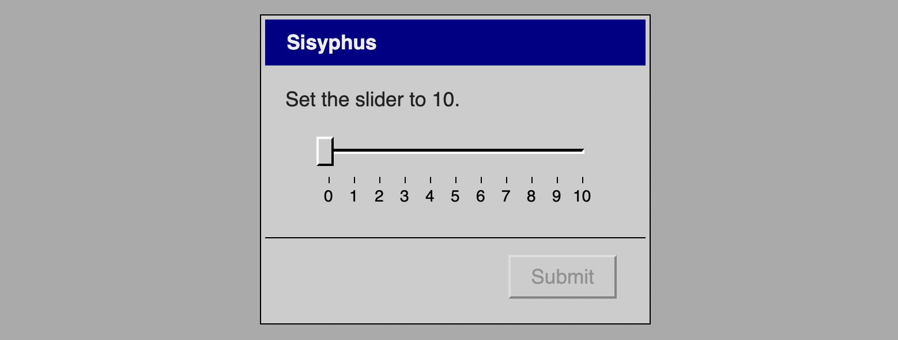

# *Let's Play: Ancient Greek Punishment: UI Edition*

# [Play Online](https://www.pippinbarr.com/lets-play-ancient-greek-punishment-ui-edition/) (desktop and mobile)

## Description
*Sliders! Radio buttons! Dialog boxes! Menus! Progress bars! These are the instruments of our eternal contemporary torment! The ancient Greek gods would have approved! We are all Sisyphus now!*

_Let's Play: Ancient Greek Punishment: UI Edition_ is a new edition in the _Let's Play: Ancient Greek Punishment_ series. In the _UI Edition_ the myths are retold via classical user-interface experiences, from radio buttons to setup wizards to sliders.

## Press
- [Ancient Greek Punishment: UI Edition – Browser Game](https://www.freegameplanet.com/ancient-greek-punishment-ui-edition-browser-game/). Free Games Planet.
- [Die Bestrafung antiker Sagenhelden als Mini-Games (User Interface Edition)](https://nerdcore.de/2019/02/28/die-bestrafung-antiker-sagenhelden-als-mini-games-user-interface-edition/). Nerdcore. 28 February 2019.
- Joel Couture. [‘Let’s Play: Ancient Greek Punishment: UI Edition’ Inflicts Torments Through User Interfaces](https://indiegamesplus.com/2019/03/lets-play-ancient-greek-punishment-ui-edition-inflicts-torments-through-user-interfaces). Indie Games+. 20 March 2019.

Read the [Press kit](../press) for press information

## Documentation
* Read the [Closing Statement](../process/closing-statement.md) for high-level insights into the design of this game
* Read the [Process documentation](../process) for process journal, to do list, research questions and related work
* Read the [Commit History](https://github.com/pippinbarr/lets-play-ancient-greek-punishment-ui-edition/commits/master) for step-by-step information about how the project was built
* Look at the [Code Repository](https://github.com/pippinbarr/lets-play-ancient-greek-punishment-ui-edition) for source code etc.

## License
_Let's Play: Ancient Greek Punishment: UI Edition_ is an open source game licensed under a [Creative Commons Attribution-NonCommercial 3.0 Unported License](http://creativecommons.org/licenses/by-nc/3.0/). You can obtain the source code from its [code repository](https://github.com/pippinbarr/lets-play-ancient-greek-punishment-ui-edition) on GitHub.
