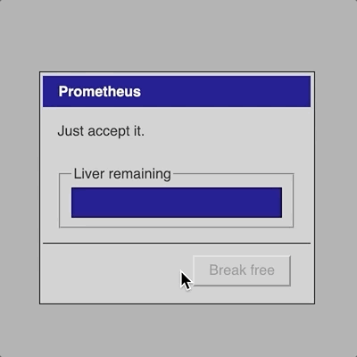
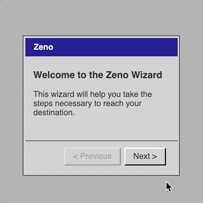
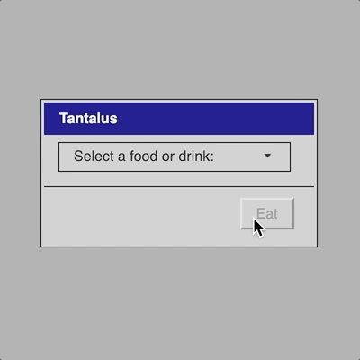
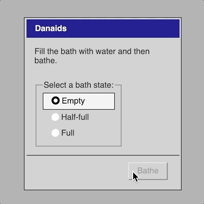
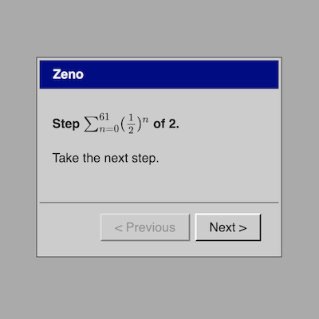

# _Let's Play: Ancient Greek Punishment: UI Edition_ Closing Statement: The unusable usability of ancient Greek punishments

_Let's Play: Ancient Greek Punishment: UI Edition_ (hereafter: _UI Edition_) is the sixth game in my _Let's Play: Ancient Greek Punishment_ series. Each of the games has retold ancient Greek punishment myths (somewhat loosely defined, given the inclusion of [Zeno's Paradox](https://en.wikipedia.org/wiki/Zeno%27s_paradoxes)) from different perspectives, whether focusing on [presenting them straightforwardly](http://www.pippinbarr.com/games/letsplayancientgreekpunishment/LetsPlayAncientGreekPunishment.html) as a punishment for the player to experience, as a meditation on whether a [computer can punish itself](http://pippinbarr.github.io/letsplayancientgreekpunishmentcpuedition/), or what it's like to be the [tormentor instead of the tormented](https://pippinbarr.github.io/lets-play-ancient-greek-punishment-inversion-edition). In the following, I want to write a little about the key features and themes of the games development and intent.

## Origin story

The _UI Edition_ proposes a translation of the myths away from the language of pseudo-retro minigames and into the language of conventional user-interfaces. The idea for the game itself began when I assign my programming students a project to build a "Sisyphean experience" using [jQuery UI](https://jqueryui.com/), a JavaScript library that facilitates the creation of traditional user-interfaces (and which I have used in the past for [It is as if you were doing work](http://pippinbarr.github.io/itisasifyouweredoingwork/) and [It is as if you were making love](https://pippinbarr.github.io/itisasifyouweremakinglove/)). In assigning the project I saw an image of a slider, diagonally oriented, with the user dragging the handle to the top only to see it slide back down, a UI-mimicry of the Sisyphus myth. The comedy value of this, along with the challenge of reimagining the myths in this different domain was enough for me to decide to go ahead.

## Turning on the wheel of usability

One of the more interesting outcomes of choosing to work with traditional UI elements was the immediate connection it made to tradition UI concerns such as _usability_. All videogames deal with usability (such as making their controls accessible and understandable, say), but when your game _is_ a user interface it feels magnified. Specifically, a game tends to need to be usable in one direction (the interface itself, the menu systems) while being "unusable" in another direction (the challenges presented by the gameplay), though also being secretly usable there too (the challenges are, usually, designed to be overcome).

With this game, I found myself thinking extensively about the role and significations of usability concerns. Thus, for instance, I found it necessary to _remove_ certain usability-enhancing features of the elements, such as the ability to click on the body of a slider to set it rather than drag the handle (commit [47a13ab](https://github.com/pippinbarr/lets-play-ancient-greek-punishment-ui-edition/commit/47a13abbc2fcb158401a90a81fc961c604c60461)). Relatedly, when I posted animated GIFs of the project online, one form of feedback was people citing how the game could be beaten by resorting to other forms of usability and convenience, such as keyboard shortcuts, prompting me to immediately _remove_ those possibilities (commit [5cf58cd](https://github.com/pippinbarr/lets-play-ancient-greek-punishment-ui-edition/commit/5cf58cd47e5293007334cbce71c47dc53014a69c)).

In fact, the context of _punishment_ being the core of the game is even more bizarre when thinking about usability. The core loop of the punishment needs to be "usable" in the sense that you need to be able to perform the task (Prometheus can struggle to dislodge the eagle), but totally _unusable_ in the sense that the task cannot be completed (Prometheus can never escape his chains). I wrote more about this question of [usability and punishment](https://github.com/pippinbarr/lets-play-ancient-greek-punishment-ui-edition/blob/master/process/process-journal.md#notes-on-sisyphus-danaids-and-tantalus-usability-and-punishment-monday-28-january-2019-742am) in the process journal.

## Language games

A big vector of design I hadn't actually thought of when embarking on the game was the roll of _language_. Where the previous games in the series have communicated the current state through graphics, this game needs to communicate in a combination of user interface state and _texts_ that clarify that state. The most obvious example of this was the Zeno interface, which I struggled with significantly until I found the right language for it: the classic step-by-step process in which you click a "next" button. The fact these dialogs are called "steps" is pleasing given the dual meaning here of a step in the UI progress, but also a metaphorical step in the footrace Zeno is literally running in reference to the previous games (commit [bb9a275](https://github.com/pippinbarr/lets-play-ancient-greek-punishment-ui-edition/commit/bb9a27571df4d0e9a9f07d3dbe0136f4f53ba4bd)). Zeno was completed properly at the moment I [realized that these step-by-step interfaces are typically "Wizards" in the Windows context](https://github.com/pippinbarr/lets-play-ancient-greek-punishment-ui-edition/blob/master/process/process-journal.md#sound-the-spareness-of-zenos-steps-designing-for-mobile-friday-1-february-2019-650am) and that those wizards have specific language involved, such as a "welcome" screen that gives meaning to the overall process. Having a welcome screen allowed me to set expectations for the ensuing steps, making their bluntness (you just take step after step with no real effect beyond the step count) more of a relentless punch-line rather than needing to serve as the whole joke (commit [8163eff](https://github.com/pippinbarr/lets-play-ancient-greek-punishment-ui-edition/commit/8163eff94408078046b53ece8cd754abc2a3ec4e)).

Beyond Zeno, all the games ended up needing language passes as I tried to balance the studied neutrality common to user interfaces alongside the desire to convey the context and richness of the mythological basis for each interface. Notably, I needed to think hard about whether the conceit of the game was more to represent these punishments _purely_ as their interface equivalents (and so without "narrative" content), or whether it was to "retell" the stories in the language of UI (in which case the narrative could still be present) (commit [69ea7fe](https://github.com/pippinbarr/lets-play-ancient-greek-punishment-ui-edition/commit/69ea7fef9644cc622f0516ea3032725b1c757dbd)). Although I largely decided on the latter, I think there's still a range here, from the more interface-leaning Sisyphus to the very clearly narrative Tantalus.

By way of a simple example of all this, consider the possible labelling of a "submission" button for a dialog (generally disabled because the dialog cannot be completed). Initially they were all labelled "submit" in keeping with UI traditions, but after my language passes they tended to be labelled with more myth-relevant actions such as "Eat" for Tantalus or "Bathe" for the Danaids. (See more in the process journal [here](https://github.com/pippinbarr/lets-play-ancient-greek-punishment-ui-edition/blob/master/process/process-journal.md#on-submission-monday-28-january-2019-1021am) and [here](https://github.com/pippinbarr/lets-play-ancient-greek-punishment-ui-edition/blob/master/process/process-journal.md#mobile-mobile-danaids-language-games-nearing-the-end-monday-4-february-2019-643am))

## All interactions are physical

In contrast to these more conceptual ideas conveyed in language, I was also very interested in the "physicality" of the UI interactions. Generally speaking these kinds of interactions are meant to be relatively invisible or transparent, but as I worked on the game it seemed to me that it was important that there was some kind of physical metaphor at work in each beyond just the language. Thus consider how in Tantalus it's just just the case that the options for food and drink are greyed-out and inaccessible but that you literally _reach_ for them with your mouse (just like Tantalus) (commit [5cf58cd](https://github.com/pippinbarr/lets-play-ancient-greek-punishment-ui-edition/commit/5cf58cd47e5293007334cbce71c47dc53014a69c)). Likewise as Sisyphus you physically move the "boulder" (slider handle) and as Zeno you consciously "take each step. It's not always present, but where possible I found it really satisfying.

A good negative example here is the initial version of Danaids which was to be represented as dragging a "water.png" file into a folder called "bath" in order to represent filling it. The file would always revert back out of the folder to represent failure, but in physical action this didn't feel like the bath emptying but rather like the bath "rejecting" the water, which didn't feel true to the experience. This worry was present from [the very beginning of my process journal](https://github.com/pippinbarr/lets-play-ancient-greek-punishment-ui-edition/blob/master/process/process-journal.md#premise-initial-designs-ui-elements-available-mobile-saturday-26-january-2019-1238pm), signifying how important it was to me in the design. The eventual solution using radio buttons that went downward from "full" to "half-full" to "empty" on a timer is another indication of trying to mimic a "physical truth", the water runs down out of the bath other time (commit [802e0b3](https://github.com/pippinbarr/lets-play-ancient-greek-punishment-ui-edition/commit/802e0b3ce97805bed901574a1deb9ff9633fb23c)).

A related design moment came with Tantalus which initially had "None" as a selectable option so that it could serve as the _default_, but which seemed incorrect because it seemed to convey the idea that Tantalus might willingly choose not to eat or drink, which isn't part of the myth. As such, the interface was redesigned to have the _instruction_ be the default option, using the selection menu itself to display its instruction (commit [84eec14](https://github.com/pippinbarr/lets-play-ancient-greek-punishment-ui-edition/commit/84eec1449815d3867bd9ae695054d097f5eee979), or indeed [jQuery UI's examples for the selection menu element](https://jqueryui.com/selectmenu/#default)).

## Playing with the player

One pleasure of making games is the unanticipated uses that players may make of them, but a further pleasure is trying to make sure you second guess your players enough to give them an acknowledgment in the game itself. The clearest example of this is with Zeno which is an attempt to represent explicitly an infinite sequence, something that's hard to do. Specifically, each step is numbered with a fractional number getting closer and closer to step 2 which means that as the player clicks further and further in, it becomes impossible for JavaScript to maintain the precision of the number (left to its own devices the number would get so close to 2 that JavaScript would just write it as 2 and Zeno would be free!). To acknowledge such a dogged player, when the game would run out of precision it switches to a [Sigma Notation](https://www.mathsisfun.com/algebra/sigma-notation.html) of the current step, a mathematical representation of what the current step's number is. When I worked this out I was _so happy_ (commit [ac9f78d](https://github.com/pippinbarr/lets-play-ancient-greek-punishment-ui-edition/commit/ac9f78dab699ad21f27f7609515fe820ee7577c1)) both form myself and for the ideal player seeing I'd thought of this for them.

My calculations suggest it would take around 5,000,000 years to exhausted the precision of the numbers involved in the sigma expression even if you clicked 60 times per second, so it's pretty safe, right? But still, it's _finite_ and the punishment is meant to be _infinite_ (acknowledged in commit [ac9f78d](https://github.com/pippinbarr/lets-play-ancient-greek-punishment-ui-edition/commit/ac9f78dab699ad21f27f7609515fe820ee7577c1)), so even after the sigma version would be exhausted I included a further step counting technique which is, in fact, infinite: peppy little messages telling you you're almost there (as a kind of prod at the eternal seeming progress bars we run into sometimes that try to make you feel better with encouraging pep talks about how they're almost done) (implemented in commit [982e66a](https://github.com/pippinbarr/lets-play-ancient-greek-punishment-ui-edition/commit/982e66a5556cd87d78dc8a6b3738f48d3fd1f928)).

## Summary

_Let's Play: Ancient Greek Punishment: UI Edition_ was a huge amount of fun to make. From a simple visual image of an impossible slider through to the actual challenges of designing and implementing the different myths from my previous games, it was a project the pushed me to think in some depth about the representations possible through traditional UI both at the level of language and interaction. It remains the case, I think, that performing these kinds of acts of "translation" of game design is an extremely valuable tool for thinking about how design itself works and how we make the decisions we make as designers.
