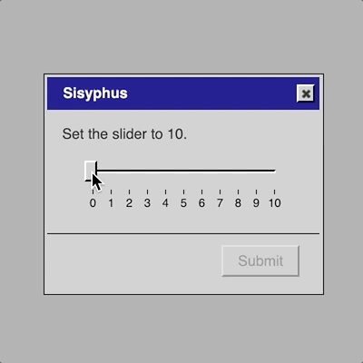

# Premise; initial designs; UI elements available; mobile? (Saturday, 26 January 2019, 12:38PM)

__Premise__

The base idea of this game is to recreate the spirit of the standard _Let's Play: Ancient Greek Punishment_ game in the form of conventional user-interface elements. Not unlike _It is as if you were making love_ in the sense that it's a translation of a particular (more human?) interactivity into the (inhuman?) language of UI.

The idea came about when I assigned "Sisyphus" as the theme for a project in my programming course dealing with jQuery and jQuery UI. I was talking to a student and had the image of a standard interface slider on an angle with the handle automatically dropping to the bottom every time you pull it to the top. And then I just assumed I could design all the rest of the games according to the same basic logic.

So let's get started - how would each of the five go? I must admit I've prepared some thoughts earlier while lying on the couch.

__Sisyphus__

A slider, ideally (?) on an angle to look like a hill. You are instructed to "Set the slider to 10" (or similar) but whenever you drag it up and slides back down again. This could be improved(?) if you had to click a "continue" button or something so that you have to let go of the slider handle - otherwise you might feel like you were succeeding if you grabbed it and held it in place? This in turn suggests that possible each punishment should be in a little window of its own. This in turn suggests that there should maybe be five application icons on the desktop that you can use to launch each one, potentially even simultaneously if you feel like it?

Quite like the idea, too, of mapping in my traditional Win95-era sounds to communciate things (though that makes normally-silent interactions a bit more videogame-y which may or may not be 'correct').

If I go the "individual applications" mode, so that the interfaces are in dialogs of their own, I wonder if the diagonal slider actually looks too awkward, and instead I should be embracing the more normal presentation (horiztonal/vertical) which the Sisyphean part being in the interaction itself and in the still-present resemblance between pushing a boulder up a hill and sliding a slider along a track, in both cases with the object reverting.

__Danaids__

Current vision is drag-and-drop interface with "water.png" or similar being dragged to a folder called "bath" maybe. Except it just reverts every time you drag it. So the instruction is "drag water.png to the bath folder" and that's always there, it's just impossible because the folder doesn't "accept it"? That's the simplest/purest version and I think it does convey the core: the bath doesn't "accept" the water in the original story because it has holes.

Guess there's a question of whether you'd want to convey the idea that the water _does_ go in and then leaks away? But that's much more complex I think? How do you show it goes in but then comes in again? I think the simplest version might be the best here - I like the idea of reducing these things to be as simple as humanly possible, so it's about the purity of the interface in combination with the idea?

__Tantalus__

Instruction asks you to select with radio button either "Apple" or "Water" (it starts as "None"). And then you're meant to click Okay or Submit. But then we have some way of undoing your action. Multiple possibilities here?

- When you go to click on Apple or Water the options become disabled, so it's like you reach for them but they become out of reach
- More extravagant would be to move the entire dialog box to avoid you being able to select them, much more literal, but less leverage of UI language
- Could also have it such that you can select but when you go to click the submit button the selection defaults back to None?

Question: why can't you submit "None" in these cases? That doesn't really make sense? Could it be that there's only two radio buttons and they have no selection? Or should they be checkboxes instead with the same idea applied - they deselect? These are probably just things that need to be tried - the core concept is there.

__Zeno__

I'm less able to visualise this, but I like the idea of leveraging a recursive effect within an interface.

My initial vision was of a sequence of checkboxes you'd be selecting, and when you got halfway it would add as many again from where you are to the end, over and over. This is a bit weird because it's a strange UI behaviour that's not very real. However that idea of recursively expanding options could possibly be explored this way?

Another option I've thought of here is that it's a dropdown menu with "First half" and "Second half" or similar, and when you go to "Second half" it opens a new submenu with the same options, ad infinitum? The labelling here could be better really though, it's a bit underwhelming and I don't quite know what the instruction would be? What are you being asked to select?

Certainly menus seem the most "reasonable" place to have an infinite recursion? We're used to the idea of nested menus, and there's no reason (beyond design) not to have them recurse. I wonder what other recursive UI elements there are.

Maybe after these initial outlines I'll also just list the available elements and see what could fit best.

__Prometheus__

This has seemed the hardest to me. At a fundamental level I think it can be represented as a progress bar for your liver that is reduced in some way. I had thought perhaps that dialogs would pop up with a timer saying that they will default to a peck if you don't cancel them, but that couples the peck and the struggle in a way that isn't in the original game. In the original game the relationship is more modal - the eagle is perched or not and that's what you control, and in the perch mode you lose liver. But this is more complex to represent probably? "The eagle has landed" is a funny text to think of being in the UI though...

There _is_ something nice about this one creating a potential profusion of dialogs though, I do like that idea. And there's nothing wrong per se with resisting the peck instead of the landing? That's not how the original game is, but I don't think it's anti-myth?

That said, consider just having one dialog at a time - what does the multitude add really? I guess it's evocative of life with popups which has merit, but it's less true to the myth in the sense there's just one eagle and one peck to resist at a time. Don't necessarily need the harried/overwhelmed vibe, which might diffuse the intensity of the one-to-one experience with the eagle? "Eagle alert!" "Alert: The Eagle has landed!"

You shouldn't be able to close any app once you've run it! Maybe even a dialog when you click the 'x' that explains the punishment/application is an infinite process. Hehe. Actually more generally the textual nature of this game might provide opportunities like that to explain/explore things more conceptually. An about dialog with a kind of "Welcome to Hades/Tartarus" discussion? HadesSoft?

__UI Elements__

Just for the record, these are the UI elements/widgets jQuery UI gives us to think about:

- Accordion

As in headers that expand... this is a pretty interesting candidate for Zeno?

- Autocomplete

As in a text box that provides suggestions as you type - haven't given this any thought at all.

- Button

Obviously useful everywhere as a standard idea. Can be used to convey effort if you're thinking about the interface to the original game, but my ideas at this point are being directed more toward UI specific expressions of the underlying concepts rather than UI re-expression of the interfaces of the games themselves.

- Checkbox

On or off. A possibility for Tantalus.

- Radio button

On or off, exclusive. Tantalus?

- Control group

Organisational. Maybe it'd be useful for something? Can't see why yet. Guess it lets you explicit group stuff in a dialog if you have more than one element involved, and you can have a little title at the top. Not the worst thing visually.

- Date picker

Pick a date. Can't quite see how this one would be of much use.

- Dialog

A base level thing to the extent I'm making each look like an application of course. And then plausibly as an extra part of something like Prometheus to represent a peck event. Dialogs are good at representing timed events I guess.

- Menu

The hierarchical menu idea. Also plausible for Zeno if I can think of how to express what you're actually trying to do with it. What the actual labelling system would be that shows you you need to continue to navigate inward (forever). Need to be able to dynamically inject new hierarchy as it goes, which I'm unclear on the possibility of. Goes for Accordion too?

- Progress bar

A progress bar. Quintessentially Sisyphean in a way, but non-interactive. Currently have it earmarked for Prometheus's liver. Would also make sense to represent any fo the ideas of progress in the games (e.g. Sisyphus, Danaids, Zeno).

- Select menu

A drop-down menu with a single set of choices (not hierarchical). Quite an attractive thing to look at. Not impossible to do this for Tantalus? You drop down to select a food but they're both greyed out? Actually more true to the original myth in the sense that for the "real" Tantalus the apple and water are just perpetually out of reach - they don't move out of the way? I don't think?

- Slider

Good old slider. Current favourite for representing Sisyphus, but could relate to something like Zeno too.

- Spinner

For representing numbers you can change with up and down arrows. Not one that is near to my  heart?

- Tabs

Ability to organise sets of information/controls into tabs. Nice in terms of representing something like a control panel, but I prefer having each of these apps have individual windows, so I don't feel this one will make much sense.

- Tooltip

Hadn't thought of it, but tooltips are potentially a nice way of providing more information. Like if you were to hover the Apple radio button it might tell you something about how delicious and desireable the apple is? A way of having flavour text without crowding the interface?

__Mobile?__

Always worth thinking about mobile right? In an ideal world I'd like things to work over there. Guess it's just a question of... can it? The recursive menus seem like a place where it may not be realistic? Especially if they scroll right (or perhaps at all). Mobile kind of sucks as a design restriction. A lot of the stuff would work though?

- Sisyphus slider - sure, should be fine
- Tantalus options - sure
- Danaids dragging - sure...? Vertical drag perhaps, but apart from that?
- Zeno menus - argh, maybe maybe not, maybe if it's only vertical scroll within the dialog of the app?
- Prometheus - multiple dialogs simultaneously seems like a bust, but even if you only have one peck at a time I think it's probably alright, it's just about presence and reaction not about being overwhelmed by multiple inputs?

---

# Notes on Sisyphus, Danaids, and Tantalus; Usability and Punishment (Monday, 28 January 2019, 7:42AM)

__Sisyphus__

Created Sisyphus yesterday (Sunday) in a quick burst - the beauty of having extremely simple, well-defined ideas for what it is you're trying to achieve. Created this gif of it, which conveys the whole thing nicely:

Very validating to post that on Twitter and have it up to over 1000 likes in less than a day. I mean, not that that's the objective here, but after a pretty tough spell of making stuff that hasn't really captured people's minds quite as much (and yes I'm just complaining) it feels good to have something accessibly interesting to people. Very easy to imagine nobody giving a shit about the game proper, but at least the idea appeals.

So Sisyphus works really well, it's effectively done already, no obvious need to do more than confirm it'll work out okay on mobile and any other full-game level tweaks to things.

__Danaids__

Built a version this morning based on the premise of dragging a file to a folder and having it revert. Obviously very easy to implement but having implemented I'm not quite blown away. I think it's a _fair_ representation but

- It does feel very similar to Sisyphus
- It perhaps doesn't quite give you the right idea about the water vanishing, since you just get it back - in the myth its not like they were recycling the same water each time, they have to go and get new water
- It feels like it's on the edge of breaking the interface level consistency because all the others are using standard UI elements which implies these things are little dialogs/control-panels, and yet Danaids is kind of pretending to be a file browser window

So those are all problems that, together, make me less than certain about it as a result. It's fine and it works okay, but it's certainly not at the level of the others?

Looking at the available UI elements isn't inspiring much either. The progress bar is the most obvious representation of water filling a container, so one could imagine using that more directly? "Fill the water progress bar"? And then figure out an interaction that you use for that, with it just sinking bank down. Even just a button? Though what kind of interface involves that? There's also the classic Windows file copying animation that could be worth a thought?

In that version perhaps it's drag and drop still (with its related problems) but it launches a new dialog with the copying process and a progress bar, and that just goes on perpetually because the progress bar keeps slipping back? That would at least feel like a more coherent representation, but doesn't dodge the problem of swapping to a file-browser model of one of these dialogs? It's not the end of the world but I don't love it... might at least save that version.

__Tantalus__

This one just worked out well like Sisyphus - by being incredibly blunt and simple. A dropdown menu where you can't select the things you want to select, a pretty perfect analogy to Tantalus's situation - he can see what he wants/needs, but he can't reach/access it. And scene.

__Usability and Punishment__

Something that's apparent from this progress is a kind of funny relationship between the ideas in these punishment myths and ideas around usability. As I wrote in commit [5cf58cd](https://github.com/pippinbarr/lets-play-ancient-greek-punishment-it-is-as-if-edition/commit/5cf58cd47e5293007334cbce71c47dc53014a69c), there's a sense in which the punishment is a matter of usability in both directions: if the interfaces were usable/accessible, then you'd be able to complete them because they wouldn't commit horrific usability gaffes like having no selectable options or (more bizarrely) having a slider that resets itself.

On the other hand, there the usability at the level of the punishment - a usable punishment, where the objective is specifically to make sure the interface is efficient, memorable, etc. with regard to being punished. In particular, this means avoiding any circumstances where the user might get out of the punishment through some clever use of UI. On Twitter people suggested things like using the tab key to select a value instead of the mouse, or dragging the slider to the top and then hitting enter to submit so it can't reset. Specifically removing those possibilities is an important part of the usability of this experience.

In a sense a standard user-interface is a really perfect representation of those ancient punishment myths - it mirrors them very well. You have the need to perform an ostensibly simple task (in many cases at least - run to a flag, pick an apple, push a stone), but the circumstances/interface won't allow you to do so. In a way I find Danaids the most interface-y of the different punishments because it's so clear (I guess Tantalus is too) - you can see the holes in the bathtub from the beginning, so it's a clear piece of interface design that signals to you everything you need to know about your punishment. Even as you're compelled to carry out the task anyway (by the gods or by the interface's refusal to be dismissed [unless you exit everything of course]).

---

# On submission (Monday, 28 January 2019, 10:21AM)

A quick note about submission since I see I flagged it in today's to-do list. I noticed this morning while working on Danaids and Tantalus that

- Danaids has no submit button
- Tantalus's submit button is never active

Not necessarily bad, but there's something here that needs thought. Part of the magic of the Sisyphus app is that there is that moment where the submission button is active and you "could" click on it. It's part of the comedy/realism around that sense of a task that seems like it could be completed only to find at the last moment it can't.

Tantalus's button never being active is maybe not the worst thing - but I think it's good that it's there at least, so there's some implication of a "reasonable" task made impossible by circumstances. In the case of Tantalus I suppose that "moment of possibility" is when you go to the dropdown menu, that's when you think/feel that this may work out, only to see that your options are greyed out at there's nothing you can do about it.

Danaids is problematic right now because there's absolutely no implication anything will ever be completed and ended. Right now it's just a file operation which isn't something you "submit" and nor is it something that dismisses its own window. This is part of the problem with using a UI representation outside the world of control panel/settings kinds of dialogs. It has a very different temporal idea? So, it's perhaps yet another flaw. Urgh.
